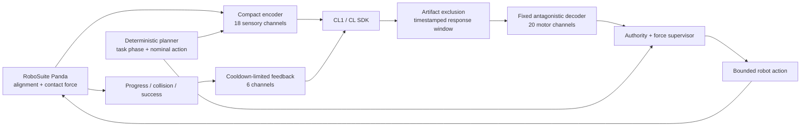

# Senxe Cerebellum — Bounded CL1 Contact-Skill Control

[](https://github.com/AzurLiu/Senxe-Cerebellum/actions/workflows/test.yml)


Senxe Cerebellum is an open experimental architecture for testing whether
living neural activity from a Cortical Labs CL1 can learn a small, bounded
contact-correction skill inside an otherwise deterministic robotic manipulation
system.

The biological component does **not** plan or control the whole robot. It may
only suggest five transparent outputs:

```text
[delta_x, delta_y, delta_z, soften, retract_request]
```

Planning, grasping, rotation, gripper intent, joint control, success
verification and hard force safety remain deterministic.

## Current status

| Area | Status |
|---|---|
| Primary task | RoboSuite `NutAssemblySquare` with Panda |
| Biological authority | Bounded five-output contact skill |
| Channel allocation | Fixed 18 sensory / 20 motor / 6 feedback / 15 reserve |
| Safety | Fail-closed stimulation and cumulative-dose enforcement |
| Evidence | Software, simulator and main-loop integration tests |
| Automated tests | 96 passing locally and in GitHub Actions |
| CL SDK compatibility | 0.1.x and 1.x simulator metadata |
| Real CL1 learning | Not yet tested |
| Physical robot driver | Not implemented |

> [!IMPORTANT]
> Simulator results validate software plumbing, causal controls and safety
> behavior. They are not evidence that a biological culture has learned, and
> this repository must not be represented as physical-robot-ready.

## Research question

Can a CL1 culture improve and retain a low-dimensional contact skill when:

- task phase and nominal motion are supplied externally;
- sensory stimulation and motor readout use a fixed channel map;
- neural authority is independently bounded on X, Y and Z;
- causal controls can remove spikes, shuffle spikes or remove feedback;
- evaluation is frozen and separated from feedback training;
- stimulation dose and every control decision are recorded?

The intended claim is deliberately narrower than end-to-end robot control.

## Architecture



### Authority boundary

| Function | Owner |
|---|---|
| task phase, approach, grasp and transport | deterministic controller |
| rotation and gripper intent | deterministic controller |
| joint commands and action clipping | deterministic controller |
| hard force stop and fallback | deterministic safety supervisor |
| small XYZ contact correction | bounded CL1 readout |
| safe movement softening | bounded CL1 readout |
| retract request | CL1 selects a deterministic retreat primitive |

Low-confidence or empty neural responses fall back to nominal control.
`soften` cannot increase movement authority. A retract request cannot generate
an arbitrary escape vector.

## Hardware-valid channel map

The confirmatory path uses pairwise-disjoint channel regions:

| Role | Count | Purpose |
|---|---:|---|
| sensory | 18 | signed XYZ alignment/force, phase and contact |
| motor | 20 | five antagonistic outputs |
| structured feedback | 6 | progress, collision and success |
| reserve | 15 | preregistered failed-channel replacement |

CL1 channels `0`, `4`, `7`, `56` and `63` are never stimulated. The exact
mapping and SHA-256 hash are stored with every evidence run.

## Safety and evidence

Before every SDK stimulation call, the proxy verifies:

- stimulatable channel membership;
- amplitude and phase width;
- burst frequency and count;
- charge balance;
- cumulative stimulation calls;
- cumulative channel pulses;
- cumulative absolute charge.

Real-hardware stimulation is blocked until the operator supplies explicit
approved limits. Calibration checks both input evoked responses and motor
readout viability. A failed fixed mapping stops the task unless a
pre-authorized deterministic reserve remap is enabled.

Each evidence record links:

- raw CL recording and timestamped spikes;
- stimulation events and delivered dose;
- nominal and final robot actions;
- force, task phase and feedback events;
- protocol, code and channel-map hashes.

## Causal evaluation

The benchmark supports:

- `contact_skill`;
- `nominal_only`;
- `zero_spikes`;
- `shuffled_spikes`;
- `no_feedback`;
- `yoked_feedback`.

The confirmatory design requires independent cultures, frozen evaluation,
held-out simulator physics, delayed retention and preregistered exclusion
rules. A learning claim must survive these controls; aggregate reward or a
demonstration video is not sufficient.

## Quick start

```bash
git clone https://github.com/AzurLiu/Senxe-Cerebellum.git
cd Senxe-Cerebellum
python -m pip install -e .
pytest -q
```

Run the audited 22-episode simulator/application path:

```bash
export SENXE_CONTROL_MODE=contact_skill
export SENXE_GENERALIZATION=1
export SENXE_SPIKE_PIPELINE=timestamped
python senxe_demo_robosuite.py
```

Run the simulator-only causal benchmark:

```bash
python run_ablation_benchmark.py
python analyze_ablations.py ablation_results.csv
python plot_ablations.py
```

Real CL1 use additionally requires operator-approved electrical and cumulative
dose limits. Candidate values in this repository are engineering defaults, not
universal biological safety approval.

## Primary files

| Path | Role |
|---|---|
| `senxe_demo_robosuite.py` | audited application entry point |
| `run_ablation_benchmark.py` | causal and confirmatory benchmark |
| `core/contact_skill.py` | compact encoder and feedback policy |
| `core/channel_map.py` | fixed hardware-valid channel allocation |
| `core/channel_health.py` | calibration health and reserve remap |
| `core/neurons.py` | CL SDK adapter and stimulation safety proxy |
| `core/spike_pipeline.py` | timestamped artifact/response windows |
| `core/provenance.py` | protocol and implementation hashes |
| `config/cl1_protocols.json` | frozen application and study phases |

## Protocols

- [Application protocol](docs/CL1_APPLICATION_PROTOCOL.md)
- [Contact-skill capability boundary](docs/CONTACT_SKILL_V1.md)
- [Confirmatory protocol V2](docs/CL1_PROTOCOL_V2.md)
- [Preregistration V2](docs/PREREGISTRATION_V2.md)
- [Archived experiments](legacy/README.md)

## Scope

This public repository contains the reproducible application architecture.
Private access-request materials and unpublished long-horizon architecture are
intentionally excluded.

## Author and license

Developed by Azur (Jiahao), independent researcher. Licensed under the
[MIT License](LICENSE).
