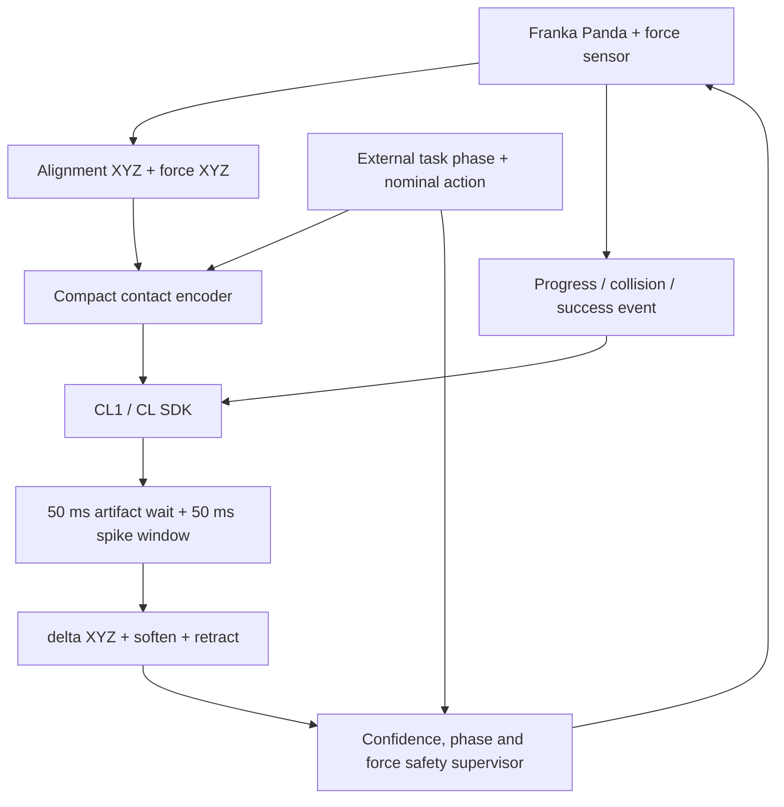

# Senxe Cerebellum: Biologically-Grounded Robotic Motor Control

> [!WARNING]
> **Original End-to-End Hypothesis Retired**
> Direct seven-dimensional wetware control is no longer the default research
> claim. The active development path uses a deterministic nominal controller
> for task phase and a confidence-gated five-output CL1 contact skill:
> three-axis translation correction, safe softening, and retract selection.
> This remains a pre-hardware hypothesis, not evidence of biological learning.

Senxe Cerebellum is an open-source research framework that interfaces living biological neural networks (via the **Cortical Labs CL1** microelectrode array platform) with high-precision industrial robotic manipulators. 

The default experiment compresses alignment error, contact force and external
task phase into sparse stimulation. Biological firing is decoded into a bounded
contact skill while planning, rotation, gripper intent, joint control and hard
safety remain deterministic.

<p align="center">
  
  <br>
  <em>Senxe Cerebellum Contact-Skill HUD (RoboSuite NutAssembly task on Franka Panda)</em>
</p>

> [!NOTE]
> **Hardware Fallback**: This framework is built directly on the official Cortical Labs `cl-sdk`. It automatically detects physical hardware; when a CL1 device is not present, it gracefully falls back to the SDK's official Poisson simulation server, enabling developers and researchers to run the entire pipeline locally.

---

## Core Scientific Modules

### 1. Compact Contact Encoding
The default [contact-skill module](core/contact_skill.py) encodes only:

* three-axis peg alignment error;
* three-axis contact force;
* externally maintained task phase and contact severity.

It uses at most one signed/magnitude channel per axis plus phase/contact flags.
The older high-dimensional VIE encoder remains available only in legacy modes.

### 2. Five-Output Contact Skill
Motor outputs use the transparent antagonistic count decoder
([core/decoder.py](core/decoder.py)). Five outputs are decoded:

```text
[delta_x, delta_y, delta_z, soften, retract]
```

*   **Opposing Populations**: The 64 channels are interleaved into opposing sub-populations:
    $$\text{Action}[i] = \frac{\text{flexor} - \text{extensor}}{\text{flexor} + \text{extensor} + \epsilon}$$
*   **Safety semantics**: `soften` can only reduce movement authority.
    `retract` selects a deterministic force-opposing retreat primitive.

### 3. External Planning and Safety
The deterministic controller owns approach, grasp, transport, rotation,
gripper intent and hard force limits. CL1 authority is enabled only during
transport/contact phases and is independently bounded on X, Y and Z.

### 4. Frozen Physical Generalization
Train scenarios vary peg offset, yaw and nut friction. Frozen evaluation uses a
disjoint held-out physics set from
[config/contact_generalization.json](config/contact_generalization.json).
Zero-spike, shuffled-spike, no-feedback and nominal-only controls use paired
scenario seeds.

---

## System Architecture



---

## Major Updates (Compared to April 2026 Release)

Since the initial release (`a1057ea` on April 13, 2026), the framework has undergone major refactoring, bug fixing, and scientific alignment:

### 1. Critical Control Loop Fixes
*   **Double Action Scaling Bug**: Resolved an issue where actions were scaled twice in both the Agent loop and the Antagonistic Decoder, which previously caused the robotic arm to stall.
*   **GymWrapper Flattening Fix**: Bypassed GymWrapper observation flattening inside `extract_obs`. This restores access to structured observation dictionaries (native force, torque, and target vector values) from the MuJoCo simulation.
*   **Action Bias Normalization**: Replaced an unconditioned, exponentially growing `action_bias` update with a bounded, clipped heuristic to prevent motor command divergence.

### 2. SDK Integration & Robustness
*   **Idempotent Context Management**: Fixed a double-close bug in the `cl_open()` context manager that caused `ClosedNodeError` crashes in PyTables on exit. The `Neurons.close()` method is now monkeypatched to be fully idempotent.
*   **STDP Plasticity Sign Inversion**: Corrected a biological STDP bug in the mock neuron simulator where Pre-before-Post spikes incorrectly triggered long-term depression (LTD) instead of long-term potentiation (LTP).
*   **NumPy 2.x Compatibility**: Added shims to support running with NumPy 2.x, silencing internal deprecation warnings from the legacy parts of the `cl-sdk`.

### 3. Scientific Rigor & Benchmarking
*   **FEP Terminology Alignment**: Deep-cleaned the codebase to replace reward-centric terminology (like "Dopamine Injection" and "Punishment") with information-theoretic terminology ("Predictable Stimulation" and "Unpredictable Stimulation"), aligning with the Free Energy Principle.
*   **Ablation Benchmark Suite**: Added a dedicated benchmark runner ([run_ablation_benchmark.py](run_ablation_benchmark.py)) and visualization utility ([plot_ablations.py](plot_ablations.py)). It runs paired-seed trials to compare the biological agent against nominal-only, no-feedback, zero-spike, and count-preserving shuffled-spike controls.
*   **Fair Baseline Comparison**: Removed hindsight experience replay (HER) reward injection during the PPO evaluation loop to guarantee a scientifically honest comparison between biological and silicon baselines.

---

## Quick Start

### 1. Installation
Install the necessary simulator and reinforcement learning baselines:
```bash
git clone https://github.com/AzurLiu/Senxe-Cerebellum.git
cd Senxe-Cerebellum
pip install -r requirements.txt
pip install cl-sdk
```

### 2. Configure MuJoCo Backend (macOS)
```bash
export MUJOCO_GL=glfw
```

### 3. Run the Biological Benchmark
Run the primary training script:
```bash
python senxe_demo_robosuite.py
```
The default mode is the bounded five-output contact skill:
```bash
export SENXE_CONTROL_MODE=contact_skill
export SENXE_GENERALIZATION=1
```
The default neural input path consumes SDK-detected spikes with their original
CL frame timestamps. It observes a post-stimulation artifact interval before
collecting decoder features:
```bash
export SENXE_SPIKE_PIPELINE=timestamped
export SENXE_ARTIFACT_WAIT_MS=50
export SENXE_COLLECT_WINDOW_MS=50
export SENXE_SPIKE_BIN_MS=10
```
The raw-voltage percentile detector is retained only for explicit compatibility:
```bash
export SENXE_SPIKE_PIPELINE=legacy_voltage
```
Optional HDF5 session recording includes raw samples, detected spikes,
stimulations, and the synchronized `senxe_control` data stream:
```bash
export SENXE_RECORD_SESSION=1
export SENXE_RECORDING_LOCATION=recordings
```
The previous single-axis and direct decoder paths are retained only as explicit
comparisons:
```bash
export SENXE_CONTROL_MODE=hybrid_residual
```
or:
```bash
export SENXE_CONTROL_MODE=legacy_wetware
```
This script runs the 7-DoF Franka Panda robot arm task, trains the biological agent, and saves a Cyberpunk-styled video overlay `cl1_nutassembly.mp4` displaying the MEA grid, force telemetry, and live status watermarks.

The current CL1-ready protocol and its evidence boundaries are documented in
[docs/CL1_PROTOCOL_V1.md](docs/CL1_PROTOCOL_V1.md). Simulator results validate
software timing and causal controls only; they are not biological-learning
evidence.

### 4. Run the Ablation Study
To run the automated information-nullification benchmark:
```bash
python run_ablation_benchmark.py
python plot_ablations.py
```
This will run headless control trials and save a learning curve comparison to `ablation_plot.png`.

---

## Author & License

*   **Author**: Azur (Jiahao) — Independent developer, incoming University of Alberta student.
*   **License**: Licensed under the MIT License (changed from AGPL v3 in June 2026).
